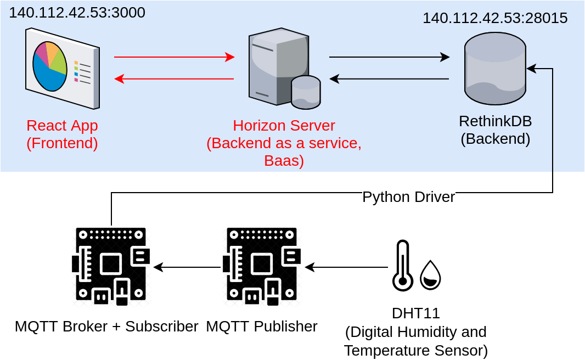
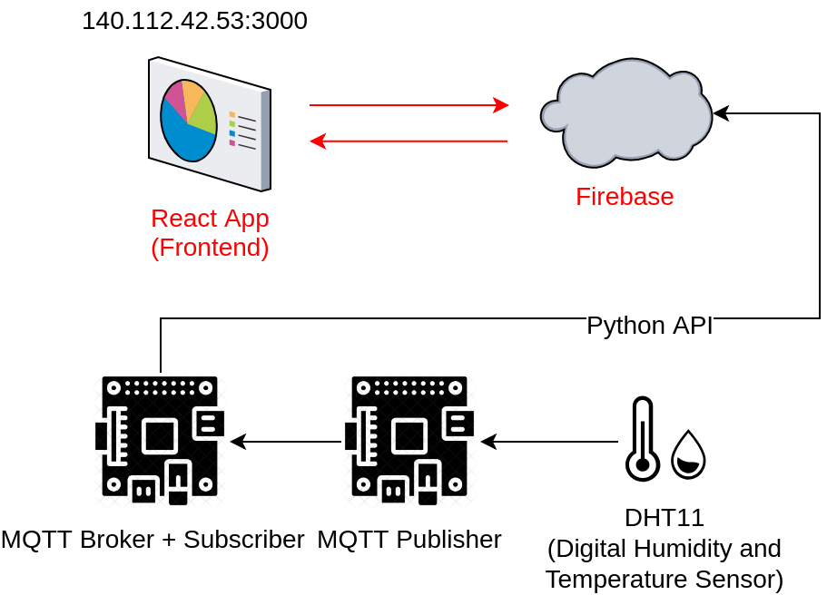

# Visualization
## Data Visualization with RethinkDB

## Data Visualization with Firebase

## Getting started
1. [Install and setup RethinkDB](./rethinkdb/rethinkdb_data/README.md)
2. [Install and setup Horizon](./horizon/README.md)
3. [Install and setup Vision](./Vision_RethinkDB_Horizon/README.md)

* In this repository, the network settings are based on running RethinkDB server, Horizon server and Vision app on a single machine with private IP address `192.168.11.34`, and providing the public service with external IP address `140.112.42.53:3000` by setting up the virtual server with the router. To deploy/test this project on your own machine, simply edit the host IP to `127.0.0.1` and ignore the IP binding in configuration files.
