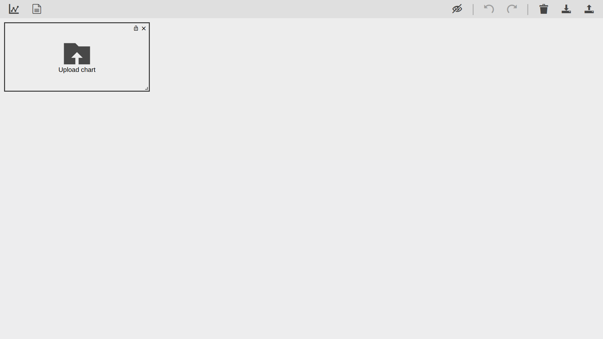
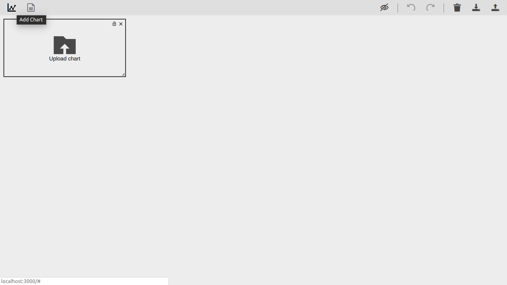
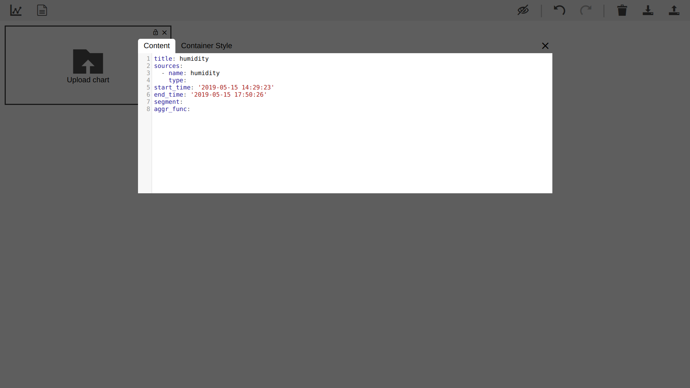
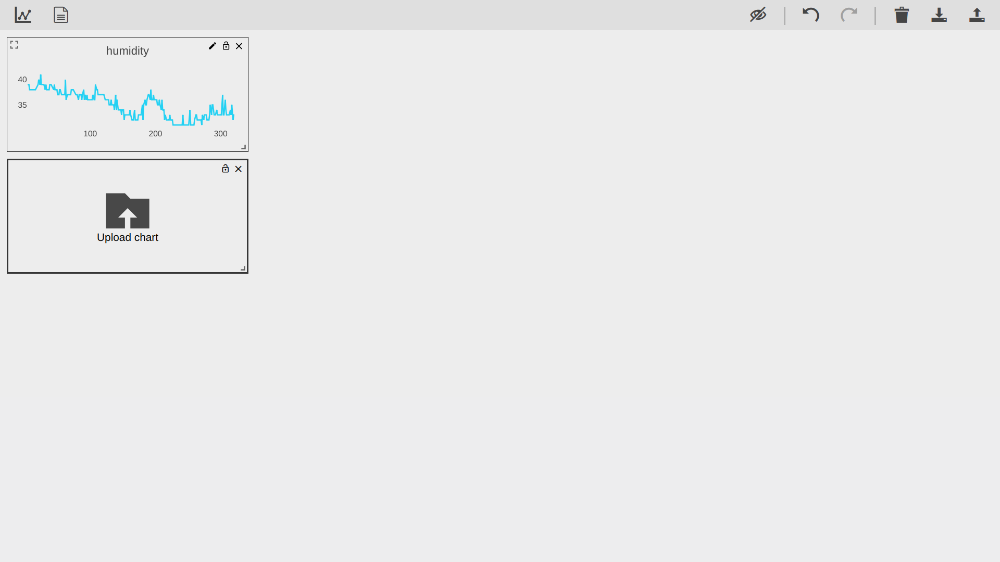

## Install required packages 
```bash
$ npm install
```
## Start developing
```bash
$ npm run start
```
## Set up the configuration file for Horizon server
To grab the data from RethinkDB via Horizon server, we need to add a configuration file called `horizon-config.json` in `./src/connectors/`.
The format of this configuration file is listed as follow:
```json
{
    "horizon": {
        "host": "140.112.42.53",
        "port": 8181,
        "table": "firetony"
    }
}
```
* `host` is the address of Horizon server.
* `port` is the listening port of Horizon server.
* `table` is the target table in RethinkDB.
## Visualizing the data
Now, we can visualize the data stored in the RethinkDB. In this repository, we have created the table and inserted some humidity/temperature data in our database. To visualize the data in assigned time period, see the follwoing steps.

1. Open the Vision app in browser

2. Click "add chart" button in the upper left.

3. Input the following `yaml` format to describe the data source
      ``` yaml
      title: humidity
      sources:
        - name: humidity
          type: 
      start_time: '2019-05-15 14:29:23'
      end_time: '2019-05-15 17:50:26'
      segment:
      aggr_func:
      ```
      
4. Show the chart
      
## Switch the backend from RethinkDB to Firebase
In `src/connectors/index.js` line 9:
```javascript
export * from './rethinkdb-horizon'
```
change to
```javascript
export * from './firestore'
```
and add a configuration file called `firebase-config.json` in `./src/connectors/`.
The format of this configuration file is listed as follow:
```json
{  "apiKey": "",
   "authDomain": "",
   "databaseURL": "",
   "projectId": "",
   "storageBucket": "",
   "messagingSenderId": ""
}
```
## Reference
https://github.com/Destinia/Vision

https://hackmd.io/KJYqoDNORlKfEEF0Ks67Hg
